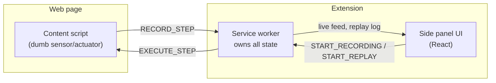

# Aperture

[](https://github.com/Jaswanth-dev-69/aperture/actions/workflows/ci.yml)

**Privacy-first browser automation.** Aperture records what you do in the browser —
clicks, typing, scrolling, whole multi-page checkout flows — and replays it later.
No screenshot, no keystroke, no page content is ever sent anywhere. It happens on
your machine, or it doesn't happen.

Built for **SIH 2026**, mapped to problem statement **SIH26171** (ISRO — *On-device
Visual Perception for Light-weight Browser Agents*). The full research report behind
this product decision is in [`sih_report.html`](./sih_report.html).

[**Landing page**](https://claude.ai/code/artifact/d026a37d-a4fa-42ba-adb4-02bdbc6e0e38) ·
[**Download (.zip)**](https://github.com/Jaswanth-dev-69/aperture/releases/latest) ·
[**License**](./LICENSE)

Not yet on the Chrome Web Store (submission needs a developer account and manual
review — see [`docs/chrome-web-store-listing.md`](./docs/chrome-web-store-listing.md)
for the draft listing). Until then, grab the `.zip` from the
[latest release](https://github.com/Jaswanth-dev-69/aperture/releases/latest) and
load it unpacked (see below).

## Why on-device

The current wave of browser agents (Claude for Chrome, OpenAI Atlas, Perplexity
Comet) work by sending your screen to a server and asking a model what to do next.
That's a bad trade when the tab you're automating has your bank, your patient
records, or your employer's internal tools open. Aperture fingerprints the elements
you interact with — by id, label, visible text, and structural position — and uses
that same resilient chain to find them again later, entirely inside your browser.
There's no server in the loop, because there's no server in the loop at all.

## How it works



A page is destroyed on every navigation, so it can't hold state — that was the
source of every early bug in this project (recording losing steps, replay stopping
partway through). The fix: the **service worker owns all state**, since it's the
one component that survives navigation. It also gets the sender's tab id for free
from `sender.tab`, so a content script never has to ask who it is before reporting
an event. The content script is deliberately dumb: it reports events and executes
steps it's handed, nothing more.

Replay resolves each recorded step back to a live element through a five-stage
fallback chain — id (compatibility-checked) → aria-label/role → exact text (with a
structural tiebreak) → structural ancestor path → bounding-box proximity as a last
resort — and reproduces the *real* recorded pacing between actions (capped at 8s),
not a fixed per-step delay.

## Project layout

```
extension/       The actual product — MV3 side panel, service worker, content script
extension/e2e/   Playwright test: loads the real built extension, records and
                 replays a full multi-page checkout against the practice site
practice-site/   A small static fake shop (shop → product → cart → checkout →
                 confirmation) used as a stable demo/test target
landing/         The public-facing landing page
sih_report.html  The research report that screened 172 SIH 2026 problem statements
                 and selected this one — read it for the *why*
```

## Running it locally

Either build from source:

```bash
cd extension
npm install
npm run build
```

...or download and unzip the [latest release](https://github.com/Jaswanth-dev-69/aperture/releases/latest)
instead of building — either way you end up with a folder to load unpacked.

Then load it as an unpacked extension:

1. Go to `brave://extensions` (or `chrome://extensions`)
2. Enable **Developer mode**
3. **Load unpacked** → select `extension/dist` (or the unzipped release folder)
4. Reload the extension after every rebuild, and refresh any already-open test tabs

Try it against the practice site:

```bash
cd practice-site
python3 -m http.server 8420
```

Open `http://localhost:8420`, click the Aperture icon, hit **Record**, browse
through the shop, and **Run** the macro back from the start.

## Testing

```bash
cd extension
npm run test:e2e   # builds the extension, then runs the Playwright suite
```

The suite loads the real built extension in a persistent Chromium context, drives
the side panel UI directly, and asserts a full record → multi-page checkout →
replay cycle reproduces the exact values that were recorded.

## Status

| | |
|---|---|
| Recorder / selector engine / replayer | ✅ Done |
| Side panel UI | ✅ Done |
| Sandboxed practice site | ✅ Done |
| Playwright E2E | ✅ Done |
| Landing page | ✅ Done |
| Chrome Web Store listing | ⬜ Not submitted yet |
| On-device vision fallback (V2) | ⬜ Not started |

See [`CLAUDE.md`](./CLAUDE.md) for the full build log and architecture notes.

## License

MIT — see [`LICENSE`](./LICENSE).
